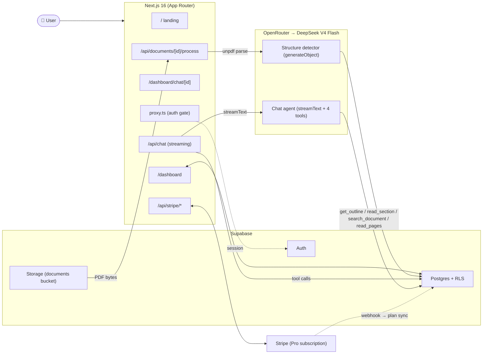

<div align="center">

# DocuMind

### Chat with any PDF — without vectors.

**Vectorless RAG document Q&A.** The LLM reads, navigates, and cites your documents agentically — no embeddings, no vector database, no chunking heuristics.

[](https://nextjs.org/)
[](https://react.dev/)
[](https://www.typescriptlang.org/)
[](https://tailwindcss.com/)
[](https://supabase.com/)
[](https://sdk.vercel.ai/)
[](https://openrouter.ai/)
[](https://stripe.com/)

**[Live demo](https://docu-mind-steel.vercel.app/)** &nbsp;·&nbsp;
**[GitHub](https://github.com/RakibulIslamm/docu_mind)** &nbsp;·&nbsp;
**[LinkedIn](https://www.linkedin.com/in/d-rakibul-islam/)**

</div>

---

## Why vectorless?

Most RAG pipelines split your document into chunks, embed each chunk into a high-dimensional vector, and retrieve the top-k closest by cosine similarity. That works for short, flat content — but it has well-known failure modes on long structured documents:

- **You lose hierarchy.** A 250-page contract has chapters, sections, sub-sections. Top-k chunks throw all that away.
- **You lose ordering.** Chunk 47 and chunk 12 might both score high, but the answer needs them _in order_.
- **You tune forever.** Chunk size, overlap, embed model, similarity threshold — every knob is a half-day of work.
- **Citations are mushy.** "Here's a chunk that scored well" isn't the same as "Section 3.2, page 14".

**DocuMind takes a different path.** When a PDF is uploaded, we parse its outline (headings, sections, page ranges) and store the full text _by page_ in Postgres with a `tsvector` index. At query time the LLM doesn't receive a pile of pre-fetched chunks — it gets four tools and decides what to read:

```
get_document_outline()  → read the table of contents
read_section(id)        → fetch one section's full text
search_document(query)  → ranked full-text search across pages
read_pages(start, end)  → raw pages, max 5 per call
```

The agent navigates the way a researcher would: TOC → relevant section → keyword search if needed → answer with real citations.

**No embeddings. No vector database. No chunking heuristics.** Just structured text, full-text search, and an LLM with tools.

---

## Features

- **Agentic navigation** — the model picks tools; no top-k retrieval
- **Real citations** — every claim links to its section and page number
- **Hierarchical TOC** — auto-detected via LLM with a code-level fallback
- **Full-text search** — Postgres `ts_rank` + `ts_headline` snippets
- **Multi-document chats** — each tool call is scoped to the conversation's document list
- **Streaming** — token-by-token answers with live tool-call disclosure and reasoning panel
- **Processing guard** — warns on page leave while a document is processing; marks docs failed via `sendBeacon` so you can reprocess
- **RLS everywhere** — every table is gated by `auth.uid() = user_id`
- **Stripe billing** — Free (3 docs / 50 Q/mo) → Pro ($29/mo, unlimited); full lifecycle: checkout → webhook → portal → cancel → resume
- **AI kill-switch** — set `AI_DISABLED=true` to disable all AI features (chat + parsing) without removing the API key
- **Dark mode** — system-aware via `next-themes`
- **Mobile responsive** — outline drawer, reasoning toggle, hero and landing fully responsive
- **Fail-soft** — session refresh proxy keeps you logged in through Supabase outages; error boundaries catch render crashes

---

## Architecture



---

## Tech stack

| Layer | Choice |
|---|---|
| Framework | **Next.js 16** (App Router, Turbopack, React 19.2) |
| Language | **TypeScript strict** |
| Styling | **Tailwind v4** + **shadcn/ui** (Base UI primitives) |
| Auth | **Supabase Auth** — email magic link + Google OAuth |
| Database | **Supabase Postgres** with Row-Level Security on every table |
| Storage | **Supabase Storage** — private bucket, per-user folders |
| PDF parsing | **`unpdf`** (PDF.js, zero native deps) |
| LLM | **OpenRouter** → `deepseek/deepseek-v4-flash` |
| AI orchestration | **Vercel AI SDK v6** (`streamText`, `generateObject`, tool loop) |
| Payments | **Stripe** — Checkout + Webhooks + Customer Portal + cancel/resume |
| Markdown | **`react-markdown`** + `remark-gfm` |
| Theming | **`next-themes`** (light / dark / system) |
| Toasts | **Sonner** |
| Analytics | **Vercel Analytics** |
| OG images | **`@vercel/og`** (edge runtime) |
| Hosting | **Vercel** |

---

## Local setup

### Prerequisites

- Node 20.9+, pnpm 10+
- A [Supabase](https://supabase.com/) project (free tier is fine)
- An [OpenRouter](https://openrouter.ai/) API key
- A [Stripe](https://stripe.com/) account (optional — only needed for the Pro billing flow)

### 1. Clone & install

```bash
git clone https://github.com/RakibulIslamm/docu_mind.git
cd docu_mind
pnpm install
```

### 2. Environment variables

```bash
cp .env.example .env.local
```

Fill in `.env.local`:

| Variable | Where to find it |
|---|---|
| `NEXT_PUBLIC_SUPABASE_URL` | Supabase → Project Settings → API |
| `NEXT_PUBLIC_SUPABASE_ANON_KEY` | Supabase → Project Settings → API |
| `SUPABASE_SERVICE_ROLE_KEY` | Same page — **server-only, never expose to the browser** |
| `OPENROUTER_API_KEY` | [openrouter.ai/keys](https://openrouter.ai/keys) |
| `OPENROUTER_BASE_URL` | `https://openrouter.ai/api/v1` (default, can omit) |
| `AI_DISABLED` | `false` — set `true` to disable all AI features without removing the key |
| `STRIPE_SECRET_KEY` | Stripe → Developers → API keys |
| `STRIPE_WEBHOOK_SECRET` | Output of `stripe listen` for dev; real webhook secret in prod |
| `STRIPE_PRO_PRICE_ID` | Stripe → Products → create a $29/mo recurring price → copy `price_…` |
| `NEXT_PUBLIC_STRIPE_PUBLISHABLE_KEY` | Stripe → Developers → API keys |
| `NEXT_PUBLIC_APP_URL` | `http://localhost:3000` for dev |

### 3. Database migrations

Run in **Supabase → SQL Editor** (in order):

```
supabase/migrations/0001_init.sql           # tables, RLS policies, storage bucket
supabase/migrations/0002_search_pages.sql   # full-text search RPC
supabase/migrations/0003_billing_state.sql  # subscription_status, cancel_at_period_end, current_period_end
```

Then under **Authentication → URL Configuration**:
- **Site URL:** `http://localhost:3000`
- **Redirect URLs:** add `http://localhost:3000/auth/callback`

For Google OAuth: **Authentication → Providers → Google** → enable and paste your credentials.

### 4. Stripe webhooks (dev only)

```bash
stripe login
stripe listen --forward-to localhost:3000/api/stripe/webhook
# copy the printed whsec_… into STRIPE_WEBHOOK_SECRET in .env.local
```

### 5. Run

```bash
pnpm dev
```

Open [http://localhost:3000](http://localhost:3000).

---

## Deploy to Vercel

1. Push to GitHub.
2. Import the repo on [Vercel](https://vercel.com/).
3. Add every variable from `.env.example` under **Project Settings → Environment Variables**.
4. Set `NEXT_PUBLIC_APP_URL` to your production domain.
5. In **Stripe → Developers → Webhooks**, add an endpoint:
   `https://<your-domain>/api/stripe/webhook`
   Events to listen for:
   - `checkout.session.completed`
   - `customer.subscription.created`
   - `customer.subscription.updated`
   - `customer.subscription.deleted`

   Copy the new signing secret into `STRIPE_WEBHOOK_SECRET` on Vercel.
6. In **Supabase → URL Configuration**, add `https://<your-domain>/auth/callback` to Redirect URLs.
7. Redeploy.

---

## Project layout

```
app/
  page.tsx                              Landing page (vectorless pitch, pricing, responsive)
  layout.tsx                            Root layout — fonts, theme provider, analytics
  opengraph-image.tsx                   Dynamic OG image (@vercel/og, edge)
  login/                                Magic link + Google OAuth
  auth/callback/route.ts                OAuth / magic-link token exchange
  dashboard/
    page.tsx                            Overview — recent documents + chats
    layout.tsx                          Sidebar shell
    actions.ts                          uploadDocument, reprocessDocument, deleteDocument
    documents/page.tsx                  Documents grid + upload dropzone + AI-disabled banner
    chats/page.tsx                      All conversations list
    billing/page.tsx                    Live Stripe state — plan, invoices, payment method
    chat/
      actions.ts                        startConversation server action
      new/page.tsx                      Single-doc convenience entry point
      [conversationId]/page.tsx         Three-panel workspace (outline · chat · reasoning)
  api/
    chat/route.ts                       streamText + 4-tool loop + message persistence
    documents/
      [id]/process/route.ts             Manual reprocess + status poll
      cancel-processing/route.ts        sendBeacon endpoint — flips processing docs to failed
    stripe/
      checkout/route.ts                 Create Stripe Checkout session (form-POST → 303)
      webhook/route.ts                  Subscription lifecycle sync to Supabase profiles
      portal/route.ts                   Customer Portal redirect
      cancel/route.ts                   In-app cancel (sets cancel_at_period_end)
      resume/route.ts                   Undo cancel (clears cancel_at_period_end / cancel_at)

components/
  chat/                                 ChatWorkspace, MessageList, OutlineTree,
                                        ReasoningPanel, ToolPill, Citations, Markdown
  dashboard/                            UploadDropzone, DocumentCard, DocumentGrid,
                                        ConversationList, NewChatDialog, UpgradeDialog,
                                        ProcessingGuard, RecentChats, RecentDocuments
  site/                                 AppShell, ThemeToggle, ThemeProvider, SignOutMenuItem
  ui/                                   shadcn/ui primitives (Button, Dialog, Sheet, …)

lib/
  ai/
    env.ts                              readOpenRouterEnv() — 3-state: configured | disabled | missing
    openrouter.ts                       getDocumindModel() — lazy OpenAI-compatible provider
    agents/document-chat.ts             System prompt + streamText config
  rag/
    parse.ts                            Pipeline orchestrator (extract → detect → build)
    extract-pages.ts                    Step A — unpdf page text extraction
    detect-structure.ts                 Step B — LLM outline detection + code-level fallback
    build-sections.ts                   Step C — section content + summaries written to Postgres
    tools.ts                            4 agent tools with per-conversation document whitelist
    citations.ts                        Citation regex extractor from assistant text
  billing/
    limits.ts                           Free-tier usage queries + canUpload / canAsk gates
  stripe/
    env.ts                              readStripeEnv() — lazy, returns configured | missing
    client.ts                           createStripeClient() — pinned API version
    subscription.ts                     pickPrimarySubscription, extractSubscriptionState
  auth/
    dal.ts                              Cached getUser() / requireUser() (Data Access Layer)
    actions.ts                          signOut server action
  supabase/
    env.ts                              readSupabaseEnv()
    client.ts                           Browser Supabase client
    server.ts                           Server Supabase client (cookie-based)
    admin.ts                            createAdminClient() — service-role, server-only
    proxy.ts                            Session refresh + protected-route auth gate

proxy.ts                                Next.js 16 request proxy (replaces middleware.ts)
supabase/migrations/                    SQL migration files
```

---

## Notes

- **Next.js 16 conventions** — `middleware.ts` is `proxy.ts` with a named `proxy` export; `cookies()`, `headers()`, `params`, and `searchParams` are all async; Turbopack is the default for both `dev` and `build`.
- **Server Action body limit** — bumped to 30 MB in `next.config.ts` to accommodate 25 MB PDFs.
- **`after()` for background parsing** — `uploadDocument` returns immediately after inserting the DB row and storing the file; `processDocument` runs via Next.js `after()` so the user gets a fast ACK.
- **Lazy env pattern** — every domain (`lib/ai/env.ts`, `lib/stripe/env.ts`, `lib/supabase/env.ts`) exports a `readX()` function that returns a discriminated union. Nothing throws at module load — pages render a "not configured" state instead of crashing.
- **AI kill-switch** — `AI_DISABLED=true` gates all AI entry points at the server level (chat API, upload action, reprocess action, manual process route) before any LLM call is made. The frontend shows a banner with a link to this repo.
- **Subscription state** — `extractSubscriptionState()` in `lib/stripe/subscription.ts` is the single source of truth shared by the webhook, cancel, resume, and billing page. It ORs `cancel_at_period_end` and `cancel_at` so both the in-app cancel path and the Customer Portal cancel path are handled identically.
- **Why DeepSeek V4 Flash** — cheap, fast, and reliable on long-context tool use. Swap the model slug in `lib/ai/openrouter.ts`.

---

## License

MIT — built by [Rakibul Islam](https://www.linkedin.com/in/d-rakibul-islam/)
