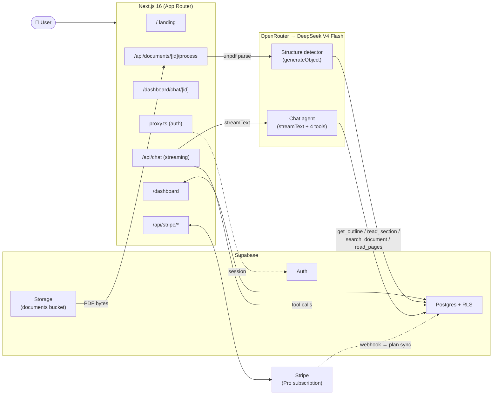

<div align="center">

# DocuMind

### Chat with any PDF — without vectors.

**Vectorless RAG document Q&A.** The LLM reads, navigates, and cites your documents agentically — no embeddings, no vector database, no chunking heuristics.

[](https://nextjs.org/)
[](https://react.dev/)
[](https://www.typescriptlang.org/)
[](https://tailwindcss.com/)
[](https://supabase.com/)
[](https://sdk.vercel.ai/)
[](https://openrouter.ai/)
[](https://stripe.com/)

</div>

---

## Why vectorless?

Most RAG pipelines split your document into chunks, embed each chunk into a high-dimensional vector, and retrieve the top-k closest by cosine similarity. That works for short, flat content — but it has well-known failure modes on long structured documents:

- **You lose hierarchy.** A 250-page contract has chapters, sections, sub-sections. Top-k chunks throw all that away.
- **You lose ordering.** Chunk 47 and chunk 12 might both score high, but the answer needs them *in order*.
- **You tune forever.** Chunk size, overlap, embed model, similarity threshold — every knob is a half-day of work.
- **Citations are mushy.** "Here's a chunk of text that scored well" isn't the same as "Section 3.2, page 14".

**DocuMind takes a different path.** When a PDF is uploaded, we parse its outline (headings, sections, page ranges) and store the full text *by page* in Postgres with a `tsvector` index. At query time the LLM doesn't get a pile of pre-fetched chunks — it gets four tools and decides what to read:

```
get_document_outline()  → read the table of contents
read_section(id)        → fetch one section's full text
search_document(query)  → ranked full-text search across pages
read_pages(start, end)  → raw pages, max 5 per call
```

The agent navigates the way a researcher would: TOC → relevant section → keyword search if needed → answer with real citations.

**No embeddings. No vector database. No chunking heuristics.** Just structured text, full-text search, and an LLM with tools.

## Live demo

> Replace with your deployed URL after Vercel deploy.

🌐 **[documind.app](https://documind.app)** &nbsp;·&nbsp; 🎥 **[Loom walkthrough](#)** &nbsp;·&nbsp; 📦 **[GitHub](#)**

## Architecture



## Tech stack

| Layer | Choice |
|---|---|
| Framework | **Next.js 16** (App Router, Turbopack, React 19.2) |
| Language | **TypeScript strict** |
| Styling | **Tailwind v4** + **shadcn/ui** (`base-sera` style on `@base-ui/react`) |
| Auth | **Supabase Auth** (email magic link + Google OAuth) |
| Database | **Supabase Postgres** with **Row-Level Security** on every table |
| Storage | **Supabase Storage** (private bucket, per-user folders) |
| PDF parsing | **`unpdf`** (PDF.js, no native deps) |
| LLM | **OpenRouter** → `deepseek/deepseek-v4-flash` |
| AI orchestration | **Vercel AI SDK v6** (`streamText`, `generateObject`, tool loop) |
| Markdown rendering | **`react-markdown`** + `remark-gfm` |
| Theming | **`next-themes`** (light/dark + system) |
| Payments | **Stripe** Checkout + Customer Portal + Webhooks |
| Analytics | **Vercel Analytics** |
| OG images | **`@vercel/og`** (edge runtime) |
| Hosting | **Vercel** |

## Features

- 🧠 **Agentic navigation** — the model picks tools; no top-k retrieval
- 📍 **Real citations** — every claim links to its section and page
- 🌳 **Hierarchical TOC** — auto-detected via LLM with code-level fallback
- 🔍 **Full-text search** — Postgres `ts_rank` + `ts_headline` snippets
- 📄 **Multi-document chats** — each tool gets a per-conversation document whitelist
- ⚡ **Streaming** — token-by-token answers with live tool-call disclosure
- 🔒 **RLS everywhere** — every table is gated by `auth.uid() = user_id`
- 💳 **Stripe billing** — Free (3 docs / 50 Q/mo) → Pro ($29/mo unlimited)
- 🌓 **Dark mode** — system-aware
- 📱 **Mobile responsive** — outline drawer + reasoning toggle
- 🛡️ **Fail-soft** — proxy keeps you logged in through Supabase outages; error boundaries catch render crashes

## Setup

### 1. Prereqs

- Node 20.9+, pnpm 10+
- A Supabase project (free tier is fine)
- An OpenRouter API key
- A Stripe account (only needed if you want the Pro flow live)

### 2. Install

```bash
pnpm install
```

### 3. Environment

```bash
cp .env.example .env.local
```

| Variable | Where it comes from |
|---|---|
| `NEXT_PUBLIC_SUPABASE_URL` | Supabase → Project Settings → API |
| `NEXT_PUBLIC_SUPABASE_ANON_KEY` | Supabase → Project Settings → API |
| `SUPABASE_SERVICE_ROLE_KEY` | Same page — keep server-only |
| `OPENROUTER_API_KEY` | https://openrouter.ai/keys |
| `OPENROUTER_BASE_URL` | `https://openrouter.ai/api/v1` |
| `STRIPE_SECRET_KEY` | Stripe → Developers → API keys |
| `STRIPE_PRO_PRICE_ID` | Stripe → Products → create $29/mo recurring → copy `price_…` |
| `STRIPE_WEBHOOK_SECRET` | `stripe listen` output (`whsec_…`) for dev; real webhook secret in prod |
| `NEXT_PUBLIC_STRIPE_PUBLISHABLE_KEY` | Stripe → Developers → API keys |
| `NEXT_PUBLIC_APP_URL` | `http://localhost:3000` for dev |

### 4. Database

Run the migrations in Supabase → SQL Editor (in order):

```bash
supabase/migrations/0001_init.sql           # tables, RLS, storage bucket
supabase/migrations/0002_search_pages.sql   # full-text search RPC
```

Then in Supabase → *Authentication → URL Configuration*:
- **Site URL:** `http://localhost:3000`
- **Redirect URLs:** add `http://localhost:3000/auth/callback`

For Google OAuth: *Authentication → Providers → Google* → enable.

### 5. Stripe webhooks (dev)

```bash
stripe login
stripe listen --forward-to localhost:3000/api/stripe/webhook
# copy the whsec_… into STRIPE_WEBHOOK_SECRET
```

### 6. Run

```bash
pnpm dev
```

Open [http://localhost:3000](http://localhost:3000).

## Deploy to Vercel

1. Push to GitHub.
2. Import the repo on Vercel.
3. Add every variable from `.env.example` to *Project Settings → Environment Variables*.
4. Set `NEXT_PUBLIC_APP_URL` to your production URL.
5. In Stripe → Developers → Webhooks → add endpoint:
   `https://<your-domain>/api/stripe/webhook`
   - Events: `checkout.session.completed`, `customer.subscription.updated`, `customer.subscription.created`, `customer.subscription.deleted`
   - Copy the new signing secret into `STRIPE_WEBHOOK_SECRET` on Vercel.
6. In Supabase → URL config, add `https://<your-domain>/auth/callback`.
7. Redeploy.

## Project layout

```
app/
  page.tsx                              Landing page
  opengraph-image.tsx                   Dynamic OG image (@vercel/og)
  login/                                Supabase auth (magic link + Google)
  auth/callback/route.ts                OAuth + magic-link exchange
  dashboard/
    page.tsx                            Documents grid + recent chats
    actions.ts                          uploadDocument, reprocess, delete
    billing/page.tsx                    Stripe billing page
    chat/
      actions.ts                        startConversation
      new/page.tsx                      Single-doc convenience entry
      [conversationId]/page.tsx         Three-panel chat workspace
  api/
    chat/route.ts                       streamText + tool loop + persistence
    documents/[id]/process/route.ts     Reprocess + status poll
    stripe/
      checkout/route.ts                 Create checkout session
      webhook/route.ts                  Subscription event sync
      portal/route.ts                   Customer portal redirect

components/
  chat/                                 Workspace, message list, tool pills,
                                        reasoning panel, markdown, citations
  dashboard/                            Upload, document card, conversation
                                        list, usage badge, upgrade dialog,
                                        billing actions, new-chat dialog
  site/                                 Layout headers, theme toggle/provider,
                                        sign-out menu item

lib/
  ai/
    openrouter.ts                       OpenAI-compatible provider for OpenRouter
    agents/document-chat.ts             System prompt + streamText config
  rag/
    parse.ts                            Pipeline orchestrator (A → B → C)
    extract-pages.ts                    Step A — unpdf page extraction
    detect-structure.ts                 Step B — LLM outline + chunk fallback
    build-sections.ts                   Step C — content + summaries
    tools.ts                            4 agent tools, document-id whitelist
    citations.ts                        Citation regex extractor
  billing/
    limits.ts                           Free-tier usage queries + enforcement
    stripe.ts                           Stripe client + env helpers
  auth/
    dal.ts                              Cached getUser / requireUser
    actions.ts                          signOut server action
  supabase/
    client.ts                           Browser client
    server.ts                           Server + service-role clients
    proxy.ts                            Session refresh + auth gate

proxy.ts                                Next.js 16 proxy (was middleware.ts)
supabase/migrations/                    SQL migrations
```

## Roadmap (phases)

- **Phase 1** ✅ Scaffold + Auth + DB schema
- **Phase 2** ✅ PDF upload, parse, hierarchical TOC, page storage
- **Phase 3** ✅ Agentic chat with streaming + 4 tools + citations
- **Phase 4** ✅ Multi-document chat, free-tier enforcement, conversation history, dark mode, mobile
- **Phase 5** ✅ Stripe subscriptions, polished landing page, SEO + OG image, analytics, deploy

## Notes

- **Next.js 16 specifics**: `middleware.ts` is now `proxy.ts` (named `proxy` export); `cookies()` / `headers()` / `params` / `searchParams` are async; Turbopack is the default for both `dev` and `build`.
- **Server Action body limit**: bumped to 30MB in `next.config.ts` to fit 25MB PDFs.
- **`after()` for background work**: PDF parsing runs via Next.js's `after()` so the upload returns immediately and the agent can chat as soon as parsing finishes.
- **Why DeepSeek V4 Flash**: cheap, fast, and reliable on long-context tool use. Swap the model in [`lib/ai/openrouter.ts`](lib/ai/openrouter.ts).

## License

MIT
